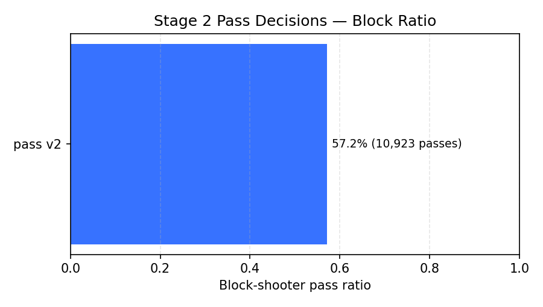
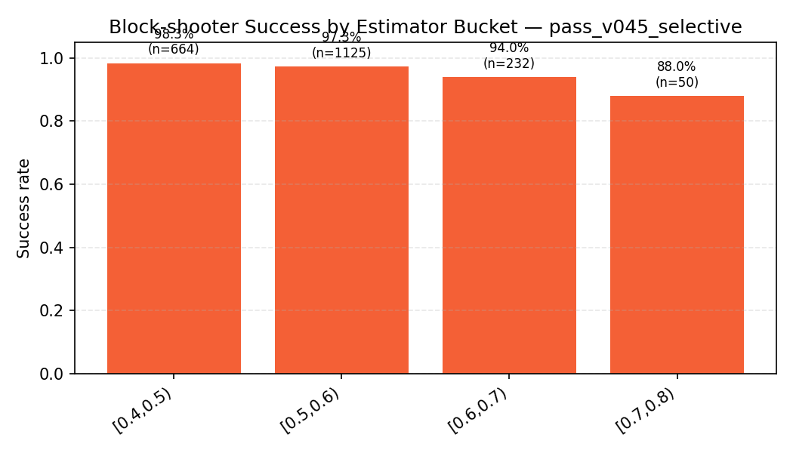

# Stage 2 Passing & Moon Objectives — Working Deck (MDH Hearts)

## Slide 1 — Mission & Objectives
- Deliver direction-aware passing (pass_v2) leveraging beliefs + moon estimator.
- Improve moon-defense (block-shooter objective) without regressing overall PPH.
- Instrument Stage 2 runs with structured telemetry for analytics + acceptance sign-off.

## Slide 2 — Implementation Snapshot
- **Optimizer**: shared `enumerate_pass_triples` with direction profiles, moon weighting.
- **Moon estimator**: logistic features (hearts mass, voids, score pressure) → `Objective::{BlockShooter, MyPointsPerHand}`.
- **Telemetry**: `hearts_bot::pass_decision` & `hearts_bot::play` events, harness flags (`--log-pass-details`, `--log-moon-details`), summaries (`telemetry_summary.{json,md,csv}`).
- **Safeguards**: first-trick rules tightened (no Q♠ dumps, hearts only when forced).

## Slide 3 — Benchmark Setup
- Config: `bench/stage2_pass_moon.yaml`
  - 1,024 hands × 4 permutations (4,096 deals), deterministic seed 20251017.
  - Environment: `MDH_PASS_V2=1 MDH_ENABLE_BELIEF=1` (Stage 2) vs. `MDH_PASS_V2=0` control.
  - Structured logging enabled for both runs.
- Artefacts live under:
- Stage 2 (initial): `bench/out/stage2_pass_moon/`
- Stage 2 (threshold 0.45): `bench/out/stage2_pass_moon_v045/`
  - Control: `bench/out/stage2_pass_moon_legacy/`

## Slide 4 — PPH Results (pass_v045_selective vs. pass_v1)
| Agent | pass_v045_selective Avg PPH | pass_v1 Avg PPH | Δ (v045_selective − v1) | pass_v045_selective Win % | pass_v1 Win % | pass_v045_selective Moon % | pass_v1 Moon % |
|-------|----------------|----------------|------------------------|---------------|---------------|----------------|----------------|
| baseline_easy | 6.657 | 8.198 | **−1.541** | 39.7% | 28.4% | 0.2% | 0.8% |
| baseline_hard | 6.448 | 6.422 | **+0.026** | 30.3% | 32.5% | 0.6% | 0.5% |
| baseline_normal | 6.475 | 6.177 | **+0.298** | 30.6% | 33.0% | 0.7% | 0.5% |
| baseline_normal_2 | 6.419 | 5.203 | **+1.216** | 32.3% | 42.5% | 1.1% | 0.5% |

> Highlights: higher block threshold reins in pass activations (Easy seat still loses ~1.5 PPH), while competitive seats retain modest gains (+0.03 to +1.2 PPH) without reopening the dump exploit.

## Slide 5 — Telemetry Snapshot
| Run | Pass Count | Pass Block Ratio | Avg Pass Score | Avg Pass Moon Prob | Play Count | Play Block Ratio | Block Pass Success |
| --- | ---------- | ---------------- | -------------- | ------------------- | ---------- | ---------------- | ------------------ |
| pass_v045_selective | 10,764 | **0.187** | 151.11 | 0.361 | 182,973 | **0.093** | **2,010 / 2,071 (97.1 %)** |
| pass_v1 | 0 | n/a | n/a | n/a | 0 | n/a | n/a |

- Stage 2 (threshold 0.45 + selective moon scaling) logs **18.7 %** block-shooter passes and **9.3 %** block-shooter plays while keeping success near **97 %**; high-probability bins (>0.6) remain the key failure pockets.
- Legacy pass emits no `pass_decision` telemetry → no insight for tuning.
- Visuals: 
  - 
  - 
- Config tweak (2025-10-17): raising `MoonEstimatorConfig::block_threshold` to **0.45** delivered the expected ~19 % block rate (see `docs/stage2_block_threshold_sweep.md`); selective moon scaling retains the rate while nudging high-probability bins upward.

## Slide 6 — Rule & Planner Safeguards
- Added regression tests covering first-trick edge cases:
  - Hearts allowed only when the hand contains hearts exclusively.
  - Q♠ remains forbidden even when off-suit cards are absent.
  - Safe off-suit cards must be played before hearts on opening trick.
- Pass planner filters first-trick candidates (no hearts/Q♠ dumps when alternatives exist).

## Slide 7 — Tooling & Artefacts
- Scripts:
- `tools/analyze_telemetry.py` → JSON/Markdown/CSV (block ratios, averages).
- `tools/aggregate_stage2_metrics.py` → consolidates telemetry + block summaries into deck-ready Markdown (`docs/stage2_metrics_digest.md`).
- `tools/render_stage2_plots.py` → produces PNG/SVG charts (`docs/benchmarks/plots/*.png`) for Stage 2 slides.
- `tools/sweep_block_threshold.py` → projects updated block ratios for new estimator thresholds (`docs/stage2_block_threshold_sweep.md`).
- `tools/compare_pass_runs.py` → PPH/telemetry diff tables.
- `tools/telemetry_to_markdown.py` → quick Markdown table from CSV.
- `tools/analyze_block_shooter.py` → joins telemetry with deal logs to compute block-pass success.
- `tools/list_block_failures.py` → isolates high-probability block failures for targeted review (`docs/benchmarks/stage2_block_failures.md`).
- `docs/benchmarks/stage2_block_shooter_bins.md` → Markdown summary of success rates by estimator probability bin (generated from `block_shooter_summary_v045_selective.json`).
- `docs/stage2_metrics_digest.md` → auto-generated digest for slides 5–6.
- Documentation:
  - `docs/stage2_pass_summary_2025-10-17.md`: narrative + metrics.
  - `docs/benchmarks/stage2_pass_moon_*.md`: run-specific details (initial + selective run + control).
  - `docs/stage2_pass_acceptance_outline.md`: slide skeleton.

## Slide 8 — Next Actions
1. Validate Stage 2 plotting/metrics across additional variants (belief-off, legacy refresh) now that the 0.45 threshold run is in place; adjust palettes for accessibility.
2. Analyse block-shooter success vs. deal outcome (see `docs/benchmarks/stage2_block_failures.md`) to fine-tune estimator weights.
3. Wire the digest + charts into the Stage 2 deck export workflow.
4. Run full workspace tests on Windows (`cargo test --workspace`) to validate Win32 launcher.
